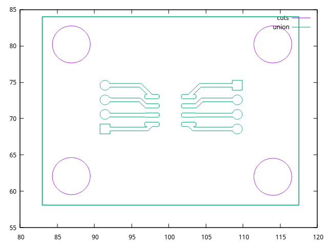
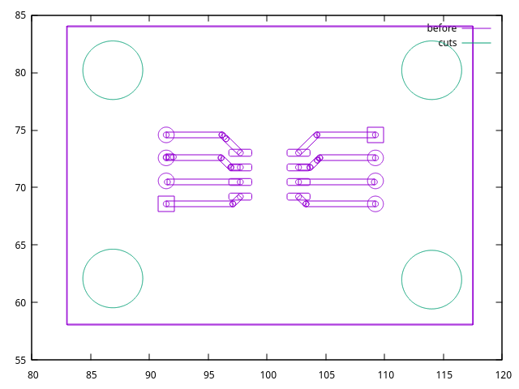

# svgpoly is a package to support SVG to polygon conversion

## Overview

This package adds support for manipulating a
[polygon](http://zappem.net/pub/math/polygon/) object representation
of the content of SVGs. This
[package](http://zappem.net/pub/graphics/svgpoly/) is for converting
an SVG file input into to a collection of such polygons.

The primary use case is digesting SVG files from KiCad and automating
the outline generation of overlapping polygons.

## How to use

First confirm `gnuplot` is available on your system. Try:
```
$ gnuplot --version
```

If it is missing, install it (Fedora: `sudo dnf install gnuplot`,
Debian: `sudo apt install gnuplot`). Then:

```
$ git clone https://github.com/tinkerator/svgpoly.git
$ cd svgpoly
$ go run examples/outline.go -- --svg examples/test.svg | gnuplot -p
```

Which should render this processed (union) image:



This is more faithful to the raw input SVG image in terms of the
overlapping polygons.

```
$ go run examples/outline.go --svg examples/test.svg --before --after=false | gnuplot -p
```

Which should render this image:



## License info

The `svgpoly` package is distributed with the same BSD 3-clause
[license](LICENSE) as that used by
[golang](https://golang.org/LICENSE) itself.

## Reporting bugs

This is a hobby project, so I can't guarantee a fix, but do use the
[github `svgpoly` bug
tracker](https://github.com/tinkerator/svgpoly/issues).
