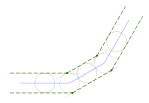
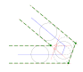

# svgpoly is a package to support SVG to polygon conversion

## Overview

This [package](http://zappem.net/pub/graphics/svgpoly/) supports
manipulating a [polygon](http://zappem.net/pub/math/polygon/) object
representation of the content of SVGs. The package is for converting
an SVG file input into to a collection of such polygons, and the
reverse process.

The primary use case is digesting SVG files from KiCad and automating
the outline generation of overlapping polygons. The package can import
SVGs using [`svger`](https://zappem.net/pub/graphics/svger/) and
output in SVG format via
[`svgof`](https://zappem.net/pub/graphics/svgof/).

## Exploring with examples

To be able to run some of the examples, confirm `gnuplot` is available
on your system. Try:

```
$ gnuplot --version
```

If it is missing, install it (Fedora: `sudo dnf install gnuplot`,
Debian: `sudo apt install gnuplot`). Then:

```
$ git clone https://github.com/tinkerator/svgpoly.git
$ cd svgpoly
$ go run examples/outline.go --svg examples/test.svg --hatch 0.3 | gnuplot -p
```

Which should render this processed (union) image:


- **Note** how this output is visually oriented the same as the input
  `examples/test.svg` but to conform to gnuplot conventions, we've
  negated the Y axis values relative to the _down the page_ SVG Y axis
  conventions.

This example is more faithful to the raw input SVG image in terms of
the overlapping polygons.

```
$ go run examples/outline.go --svg examples/test.svg --before --after=false | gnuplot -p
```

Which should render this image:


We can inflate the polygons by the value specified with the
`--inflate` option.

```
$ go run examples/outline.go --svg examples/test.svg --before --inflate 0.2 | gnuplot -p
```

Which should render this image:


Finally, you can output `*polygons.Shapes` in the form of an SVG. The
SVG follows the conventions that `.Hole`s appear white and
non-`.Hole`s as blue. A red line is used to identify the outside of a
hole shape (or, said another way, the inner edge of a solid
shape-ring):

```
$ go run examples/outline.go --svg examples/test.svg --osvg output.svg --hatch 0.3
```

Which renders as follows:


The `example/inflate.go` is provided to visualize how the
[(*polygon.Shapes).Inflate()](https://pkg.go.dev/zappem.net/pub/math/polygon#Shapes.Inflate)
function works. The basic idea is that the outline of the shape is
grown by some distance, and where the resulting outline is to be found
is where lines at that distance intersect. This example program only
outputs in SVG format. A simple invocation of this code is this:

```
$ go run examples/inflate.go --dest inflate.svg
```

Which generates three lines (of length 50, 40, 50) where each line's
exterior angle to the next is 30 degrees, it looks like this:



Here, the blue line should be thought of as the three segment section
of the original shape's outline and we are focusing on the inflation
around the corner points where three lines connect. The green dashed
lines are the outline of the inflated polygon on either side of that
original line and the surviving outline corner points are represented
as solid green circles. For an actual polygon shape, only one of these
two dashed green lines would represent the actual inflation.

What you can see is that these dashed lines are at tangents to circles
of radius `--inflate` (which defaults to 10) centered on the blue line
with centers at the midpoint and the end points of each line
segment. This first example is the simple case and does not need to
merge any points.

A more complicated example is where the bend at the joins is so tight,
it eliminates the simple points (rendered here as empty red circles)
in favor of a single merged point (solid green):

```
$ go run examples/inflate.go --dest tight.svg --alpha 70 --beta 70 --mid 10
```



## TODO

- Implement an `--inverse` operation to "fill" where the polygons
  aren't. That is, follow this strategy:

  - After a Union operation, you have polygons and holes. In the final
    render these holes will be "solid" and the shapes will be
    "holes". Both of these sets of objects are fully preserved in this
    final output.

  - First take the original shapes from before the first union (there
    are no holes) and inflate them by `--inflate`.

  - Compute the Union of these inflated shapes. Drop any holes from
    this union.

  - Add back in the shapes from the original union as holes, and holes
    from the original union in the form of shapes.

  - By construction nothing can partially overlap. So, all that
    remains is to sort the shapes to be left to right bottom to top.

## License info

The `svgpoly` package is distributed with the same BSD 3-clause
[license](LICENSE) as that used by
[golang](https://golang.org/LICENSE) itself.

## Reporting bugs

This is a hobby project, so I can't guarantee a fix, but do use the
[github `svgpoly` bug
tracker](https://github.com/tinkerator/svgpoly/issues).
